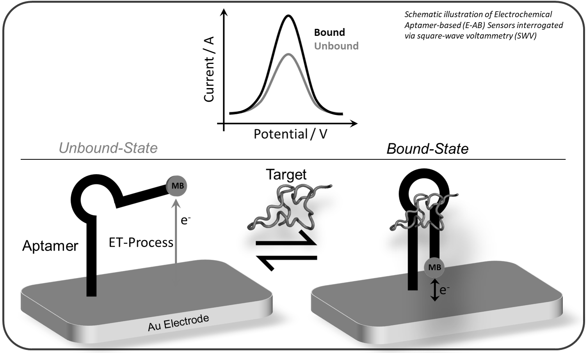
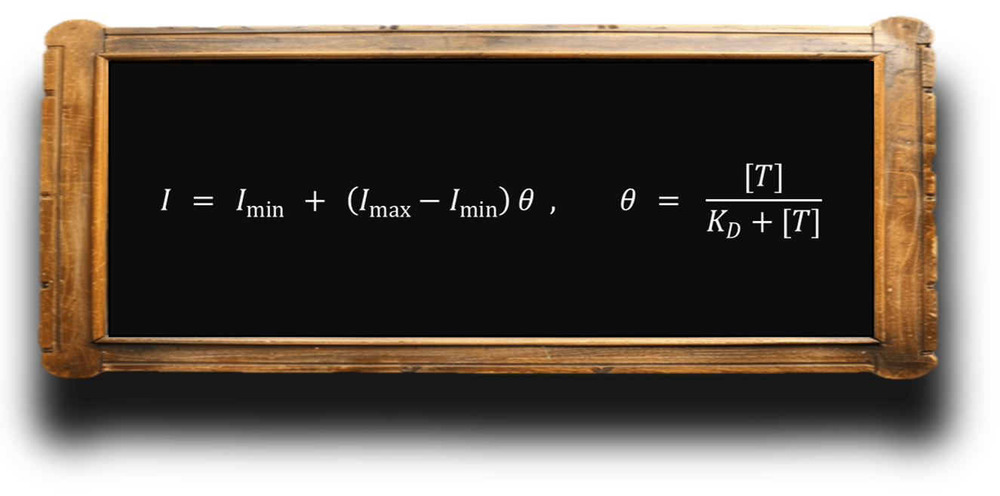
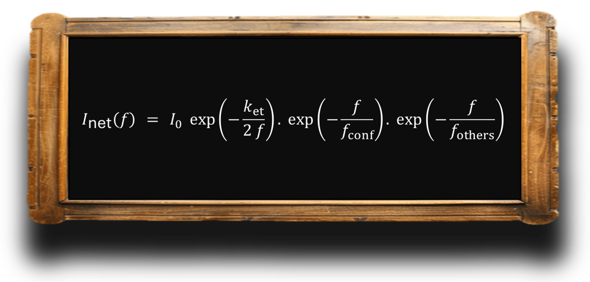
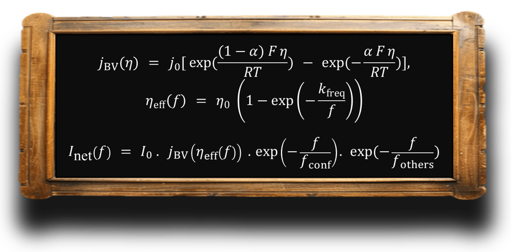
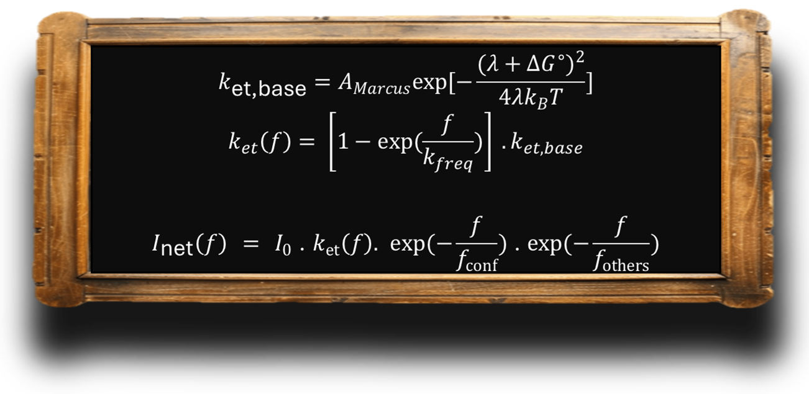
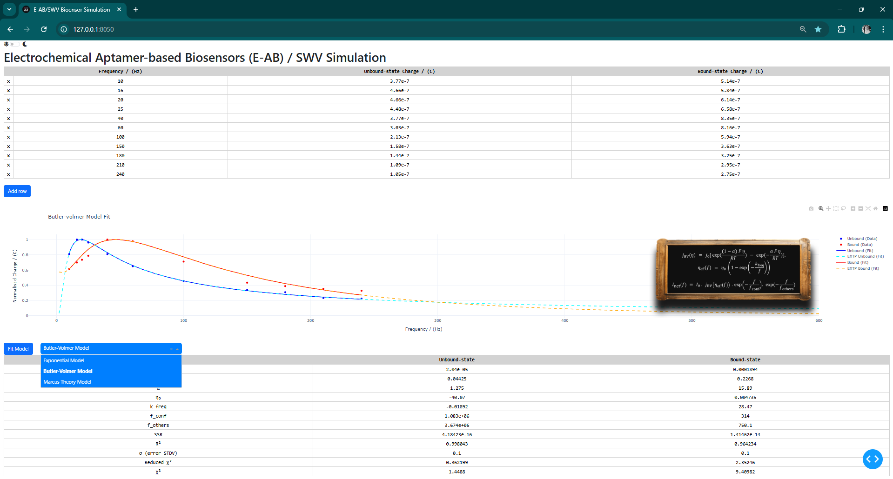

# E-AB / SWV Biosensor Simulation Platform

**Version**: 3.0.0  
**Author**: Dr Amin Haghighatbin  
**License**: Creative Commons Attribution-NonCommercial-NoDerivatives 4.0 (CC BY-NC-ND 4.0)

---

## Overview

This project is a modular, interactive Dash-based Python application for simulating the electrochemical behaviour of **Electrochemical Aptamer-Based (E-AB) sensors** under **Square Wave Voltammetry (SWV)** interrogation. It allows researchers to explore and analyse kinetic properties of aptamer–target binding using a variety of physical and theoretical models, including:

- **Empirical Double Exponential Model**
- **Butler–Volmer Kinetics**
- **Marcus Theory of Electron Transfer**

The software provides an intuitive UI for data input, model fitting, and visual comparison, alongside image overlays of model equations to facilitate interpretation.

---

## Key Features

- Real-time simulation and curve fitting of user-provided frequency-domain SWV data
- Support for multiple theoretical models
- Theme switcher (light/dark)
- Automatic calculation of R², χ², reduced-χ², and residuals
- Overlaid mathematical equations per model

---

## Theoretical Background

Electrochemical aptamer-based (E-AB) sensors represent an advanced class of biosensing platforms in which molecular recognition is transduced into an electrochemical signal via the target-induced conformational change of a surface-immobilised aptamer (oligonucleotide). These structural transitions alter the spatial proximity between a redox-active reporter (commonly methylene blue) and the electrode surface, thereby modulating the electron transfer efficiency. The resulting perturbations in faradaic current are typically interrogated using Square Wave Voltammetry (SWV)—an electroanalytical technique wherein frequency, modulation amplitude, and step potential can be finely tuned to extract kinetic information.


At a fundamental level, the electrochemical response—expressed as either peak current or integrated charge—correlates with the degree of aptamer occupancy, and can be modelled at equilibrium using the following Hill–Langmuir-like relationship:



Here, the signal amplitude reflects the fractional occupancy of the aptamer binding sites, providing a sigmoidal response as a function of target concentration. However, while such a relationship is informative at equilibrium, it remains agnostic to the dynamic processes governing signal generation in SWV. In particular, the frequency of the applied square wave pulse has a profound influence on the observed electrochemical signal and its differentiation between bound and unbound states.

To accurately interpret SWV measurements, especially for kinetic discrimination, one must consider the following frequency-dependent contributions:

Aptamer Conformational Dynamics: Target recognition often involves multistep folding pathways. The temporal resolution of SWV must be sufficient to accommodate these conformational transitions. At high frequencies, incomplete folding may attenuate signal amplitude, particularly for slowly responding aptamers.

Electron Transfer Kinetics: The distance and orientation of the redox label relative to the electrode modulate the rate of electron tunnelling. Upon target binding, the label may be repositioned closer to the electrode, accelerating the electron transfer rate—a phenomenon central to the “signal-on” design of many E-AB systems.

Double-Layer Charging (Interfacial Capacitance): The application of potential pulses induces capacitive charging of the electrode–solution interface. At elevated frequencies, the charging current can overshadow the faradaic response, effectively introducing a high-frequency penalty in signal interpretation.

Mass Transport Limitations: Although less critical in surface-confined systems, target diffusion or accumulation near the electrode may influence signal stability over repeated scans, particularly under non-equilibrium or high-frequency regimes.

Non-Specific Adsorption and Surface Blocking: Interferents, matrix components, or even the aptamer itself may cause surface fouling or steric hindrance, leading to altered double-layer characteristics and impaired electron transfer.

To encapsulate these complexities, this simulation software integrates three principal modelling frameworks, each offering a unique lens through which the frequency-dependent behaviour of E-AB systems can be interpreted. For an in-depth theoretical treatment, please refer to the accompanying documentation in the docs directory.

Fraction-Bound Response (Equilibrium View)
Captures the static relationship between aptamer binding and signal amplitude, assuming a quasi-steady-state condition.


Exponential SWV Model (Empirical Kinetic View)
An empirical approach incorporating two exponential decay terms to account for conformational gating and other frequency-sensitive penalties. Suitable for exploratory analysis and systems with indistinct mechanistic partitioning.



Butler–Volmer Model (Macroscopic Electrochemical View)
Rooted in classical electrochemical kinetics, this model considers the balance of forward and reverse electron transfer rates. **A frequency-dependent overpotential term** modulates the response, making it especially effective for capturing kinetic asymmetries between bound and unbound states.



Marcus Theory (Microscopic Quantum View)
This quantum mechanical model provides a detailed representation of electron transfer based on the reorganisation energy and Gibbs free energy change. The inclusion of **a frequency-dependent** rise factor enables it to predict the well-known Marcus inverted region and nonlinear electron transfer dynamics.



Collectively, these models offer complementary insights into how SWV frequency modulates the amplitude and shape of the electrochemical signal in E-AB sensors. By fitting real or simulated data to these frameworks, researchers can extract meaningful kinetic parameters and optimise sensor performance for target-specific detection scenarios.

---

## Usage

```bash
# Clone the repository
$ git clone https://github.com/your-username/eab-swv-simulator.git
$ cd eab-swv-simulator

# (Optional) Create virtual environment
$ python -m venv venv
$ source venv/bin/activate  # or .\venv\Scripts\activate on Windows

# Install dependencies
$ pip install -r requirements.txt

# Run the app
$ python run.py
```

---

## Folder Structure

```text
├── app.py                      # Initialises Dash app and theme
├── run.py                      # Launch script with layout and callbacks
├── layout.py                   # Layout design (UI)
├── callbacks.py                # Interactivity and model fitting
├── models.py                   # SWV model definitions (empirical + theoretical)
├── plot_utils.py               # Plot image utilities
├── config.py                   # Constants and configuration
├── data.py                     # Default input and placeholder results
│
├── docs/
│   └── Aptakin_270325.pdf      # Article discussing the theoretical aspects
│
├── assets/                     # CSS and PNG images for equations
│   ├── custom.css
│   ├── exponential.png
│   ├── fraction-bound.png
│   ├── butler-volmer.png
│   └── marcus.png
└── requirements.txt            # Python dependencies
```
---
## App Screenshot


---

## License

This work is licensed under the **Creative Commons Attribution-NonCommercial-NoDerivatives 4.0 International License (CC BY-NC-ND 4.0)**.  
You may share this work with attribution, but you may not alter or use it commercially.

For more information, visit [creativecommons.org/licenses/by-nc-nd/4.0](https://creativecommons.org/licenses/by-nc-nd/4.0/)

---


For academic enquiries, collaborations, or suggestions, please contact:  
**Dr Amin Haghighatbin**  
[LinkedIn](https://www.linkedin.com/in/amin-haghighatbin/)

